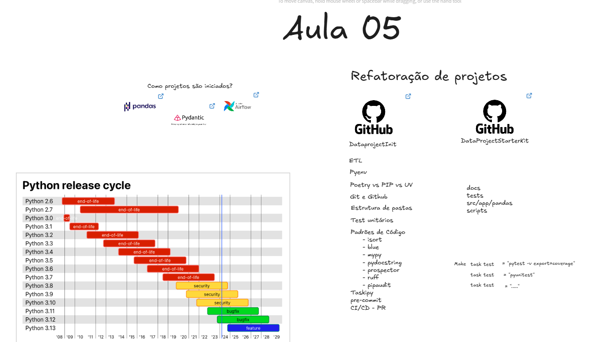

# etl_excel_aovivo

1. Arquitetura e planejamento do projeto
Para estruturar e organizar as ideias do projeto, utilizei o Excalidraw.

 [Link Excalidraw](https://link.excalidraw.com/l/8pvW6zbNUnD/4YlP0FkB9gj)


Roteiro de para rodar o projeto

1. Configurar a versão do python com pyenv para a versão 3.12.7
Escolhi a versão 3.12.7 porque é a versão mais moderna que atende a dependência do Pandas.

2. Instalar as dependências usando o Poetry
Configure o Poetry env use 3.12.7
```bash
poetry env use 3.12.7
```

Instale as dependências
```bash
poetry install
```

